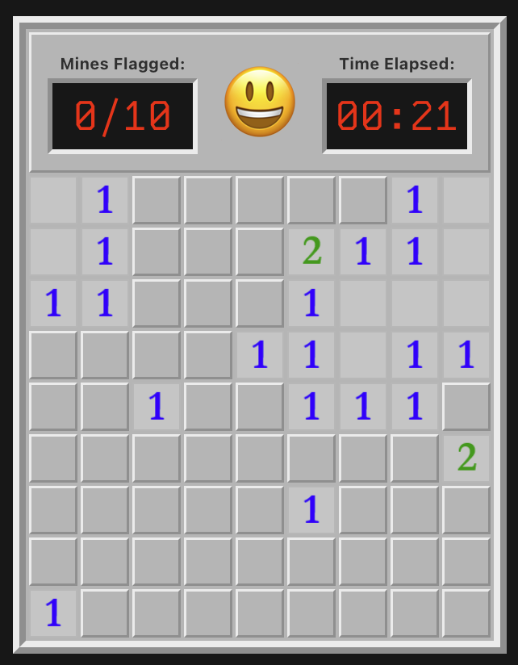

# Mine Sweeper

A Vue.js implementation of Microsoft's classic game.

I originally implemented Mine Sweeper using JavaScript & jQuery, HTML, and CSS as part of an assignment for one of the first classes I took while studying computer science at the University of Utah. I was recently looking through my [original code](https://github.com/voveson/minesweeper) (which was bad 🫣), so I decided to clean it up and port it into a fresh Vue 3 project. 

You can choose from "Beginner", "Intermediate", or "Expert" difficulties, which match those that were included in the Windows 3.11 version of the game. I also added a "Custom" difficulty, which gives you control over the number or rows, columns, and mines.

<p align="center">
    
</p>

**Warning**: just like the original, it's surprisingly addicting to play. 😉

---

## Project Setup

```sh
npm install
```

### Compile and Hot-Reload for Development

```sh
npm run dev
```

### Compile and Minify for Production

```sh
npm run build
```

### Lint with [ESLint](https://eslint.org/)

```sh
npm run lint
```
